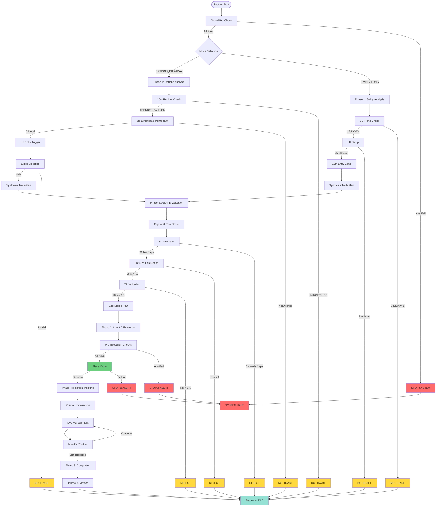
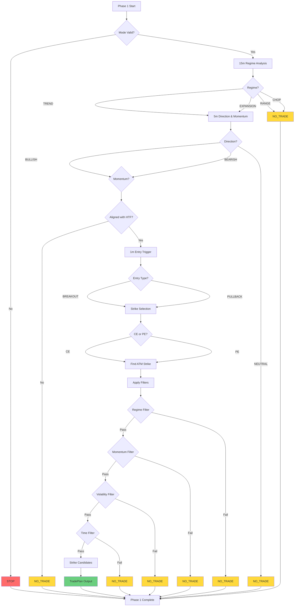
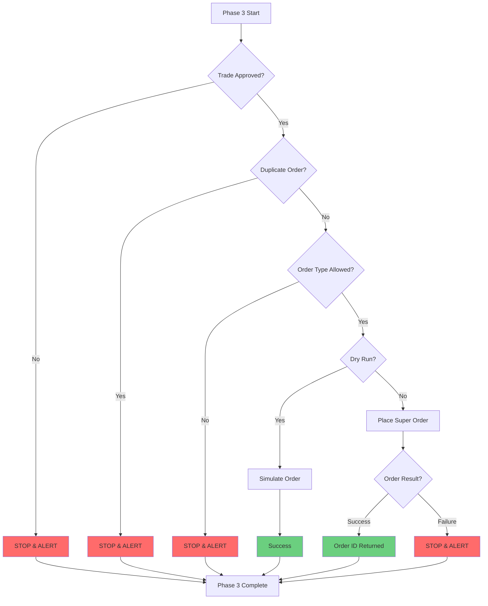
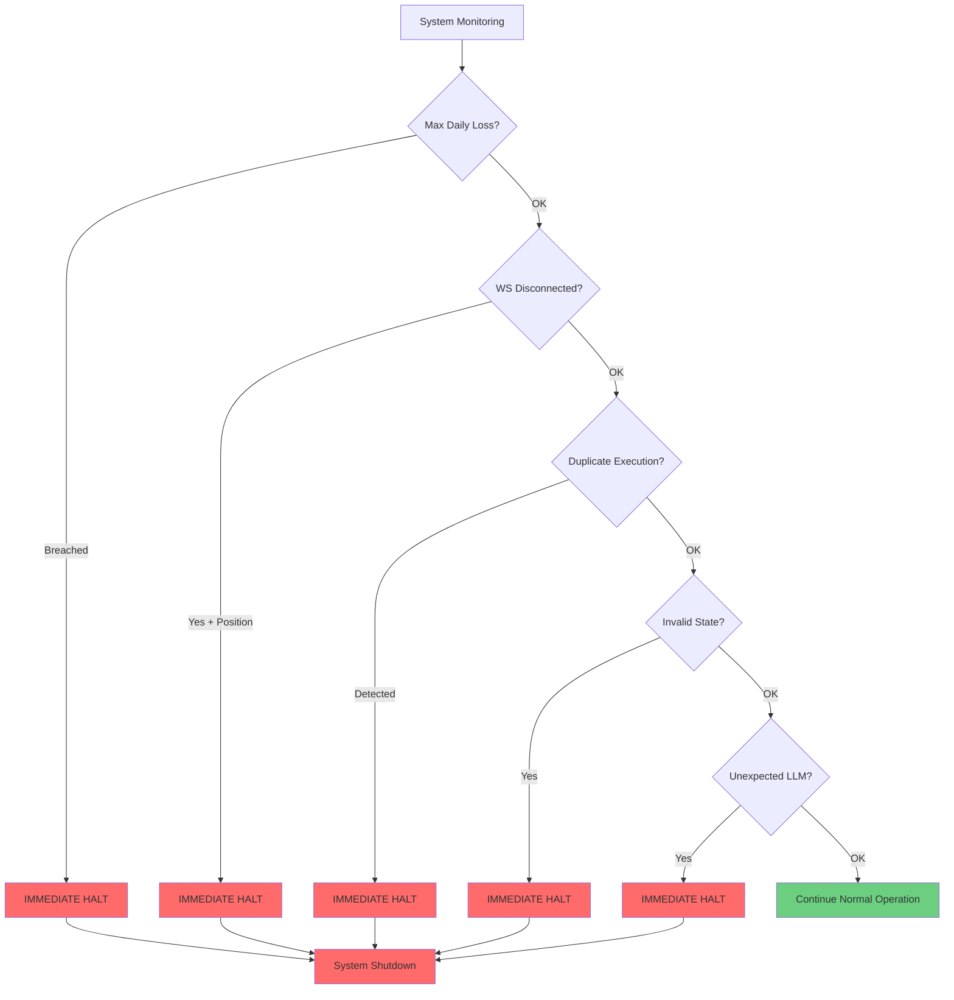
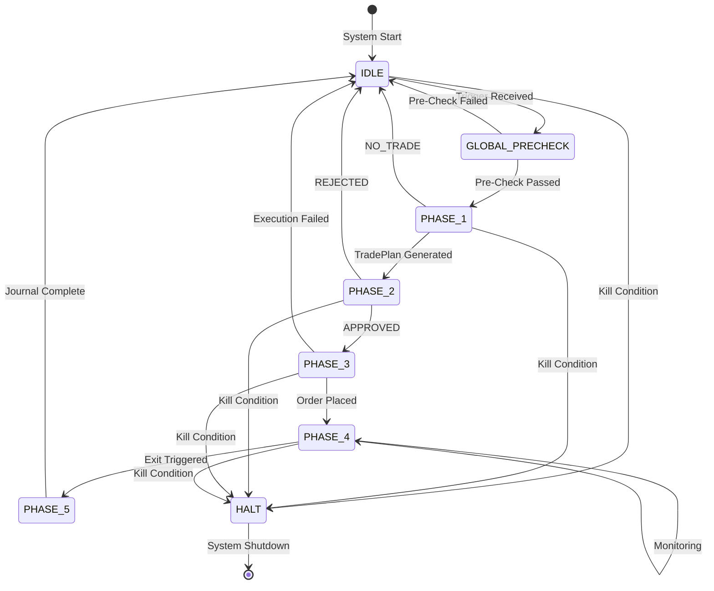
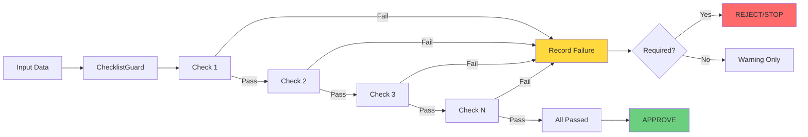

# Vyapari Phase-Based Checklist Flow Diagrams

## Complete System Flow (Mermaid)



## Phase 1: Agent A Flow (Options Intraday)



## Phase 2: Agent B Flow (Risk Validation)

```mermaid
graph TD
    START[Phase 2 Start] --> CAPITAL[Capital & Risk Check]
    CAPITAL --> FUNDS{Funds Available?}
    FUNDS -->|No| REJECT1[REJECT]
    FUNDS -->|Yes| SL_CONVERT[Convert SL Logic to Price]

    SL_CONVERT --> SL_CALC[Calculate SL %]
    SL_CALC --> SL_CHECK{SL <= Max?}
    SL_CHECK -->|NIFTY > 30%| REJECT2[REJECT]
    SL_CHECK -->|SENSEX > 25%| REJECT2
    SL_CHECK -->|Within Cap| LOT_CALC[Calculate Lot Size]

    LOT_CALC --> RISK_PER_LOT[Risk per Lot]
    RISK_PER_LOT --> ALLOWED_LOTS[Allowed Lots = floor(max_risk / risk_per_lot)]
    ALLOWED_LOTS --> LOT_CHECK{Lots >= 1?}
    LOT_CHECK -->|No| REJECT3[REJECT]
    LOT_CHECK -->|Yes| MAX_LOT{<= Max 6?}

    MAX_LOT -->|No| CAP_LOT[Cap at 6 Lots]
    MAX_LOT -->|Yes| TP_CONVERT[Convert TP Logic to Prices]
    CAP_LOT --> TP_CONVERT

    TP_CONVERT --> PARTIAL[Partial TP: 1.2x RR]
    PARTIAL --> FINAL[Final TP: 2.0x RR]
    FINAL --> RR_CHECK{RR >= Min?}

    RR_CHECK -->|No| REJECT4[REJECT]
    RR_CHECK -->|Yes| PLAN[Create Executable Plan]

    PLAN --> VALIDATE{All Fields Present?}
    VALIDATE -->|No| REJECT5[REJECT]
    VALIDATE -->|Yes| APPROVED[APPROVED]

    APPROVED --> END[Phase 2 Complete]
    REJECT1 --> END
    REJECT2 --> END
    REJECT3 --> END
    REJECT4 --> END
    REJECT5 --> END

    style REJECT1 fill:#ffd93d
    style REJECT2 fill:#ffd93d
    style REJECT3 fill:#ffd93d
    style REJECT4 fill:#ffd93d
    style REJECT5 fill:#ffd93d
    style APPROVED fill:#6bcf7f
```

## Phase 3: Agent C Flow (Execution)



## Hard System Kill Conditions



## State Machine Overview



## Checklist Validation Flow



